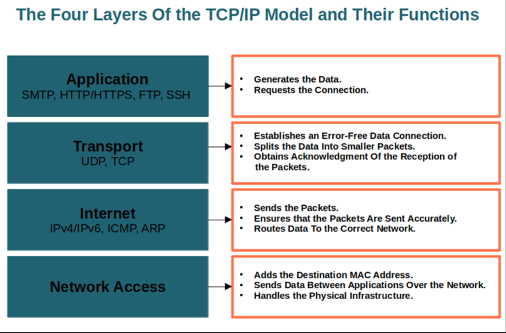

### Resources
- Building a Web Server in C++ [VS 2017] Part 1 (video)
  Link: [https://www.youtube.com/watch?v=Kc1kwm1WyV](https://www.youtube.com/watch?v=Kc1kwm1WyV)
- GitHub Markdown Documentation
  Link: [https://docs.github.com/en/get-started/writing-on-github/getting-started-with-writing-and-formatting-on-github/basic-writing-and-formatting-syntax](https://docs.github.com/en/get-started/writing-on-github/getting-started-with-writing-and-formatting-on-github/basic-writing-and-formatting-syntax)
- Quarto Markdown Basics
  Link: [https://quarto.org/docs/authoring/markdown-basics.html](https://quarto.org/docs/authoring/markdown-basics.html)

-----

Step 4: Start with Simple Implementations
Before diving into complex projects, try building a basic TCP server in C++ that can handle simple text-based communication.
Example Steps:
Create a socket and bind it to an IP address and port.
Listen for incoming connections.
Accept connections and read/write data.
Extend it to handle basic HTTP requests (GET, POST).
Resources for Practice:
GitHub examples of basic web servers 78.
YouTube tutorials on building barebones web servers in C++ 6

Suggested Learning Path
Read introductory articles on HTTP (MDN, FreeCodeCamp) 12§.
Experiment with socket programming in C++ (e.g., build a simple TCP echo server).
Study how real-world web servers work (NGINX, Apache).
Gradually implement features like handling multiple clients or serving files.

Please read the RFC and do some tests with telnet and NGINX before
starting this project.
Even if you don’t have to implement all the RFC, reading it will help
you develop the required features.

TCP - Transmission Control Protocol
IP - Internet protocol

TCP/IP model - a practical framework used to describe how data is transmitted across networks including the internet. It simplifies the communication process into four layers, each with specific responsibilities.

A simple HTTP server from scratch:
https://trungams.github.io/2020-08-23-a-simple-http-server-from-scratch/

Hypertext Transfer Protocol -- HTTP/1.1:
https://datatracker.ietf.org/doc/html/rfc2616

Beej's Guide to Network Programming:
https://beej.us/guide/bgnet/html/#what-is-a-socket

HTTP Server: Everything you need to know to Build a simple HTTP server from scratch:
https://medium.com/from-the-scratch/http-server-what-do-you-need-to-know-to-build-a-simple-http-server-from-scratch-d1ef8945e4fa

man socket
---------

curl -v http://127.0.0.1:8080/
